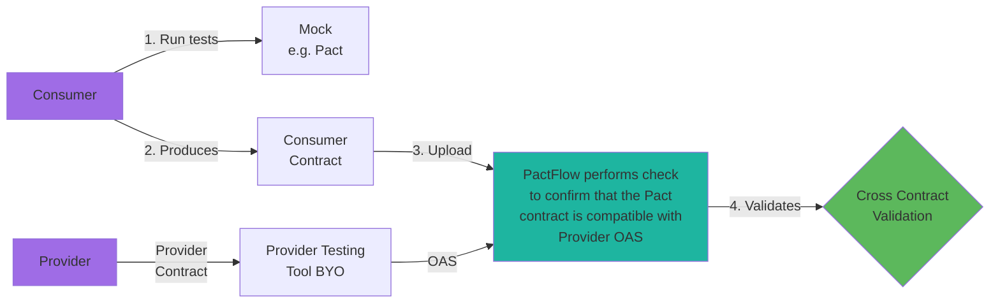

# Example TypeScript/React Consumer - Mock Service Worker (BYO Adapter)

[](https://github.com/pactflow/example-bi-directional-consumer-msw/actions/workflows/build.yml)
[](https://testdemo.pactflow.io/pacticipants/pactflow-example-bi-directional-consumer-msw/branches/master/latest-version/can-i-deploy/to-environment/production/badge)

## Overview of Example

This is an example of a TypeScript/React "Product" API consumer that uses Mock-Service-Worker, Pact, [PactFlow](https://pactflow.io) and GitHub Actions to generate and publish Pact consumer contracts.

It performs pre-deployment cross-compatibility checks to ensure that it is compatible with specified providers using the Bi-Directional contract capability of PactFlow.

See the full [PactFlow Bi-Directional Workshop](https://docs.pactflow.io/docs/workshops/bi-directional-contract-testing) for which this can be substituted in as the "consumer".

## Quick Start

Get up and running in 3 steps:

```bash
# 1. Install dependencies
npm install

# 2. Run tests and generate Pact contract
npm test

# 3. Check the generated contract
ls -la pacts/
```

You should see a Pact contract file generated in the `pacts/` directory! This contract represents the consumer's expectations of the Provider API.

> [!TIP]
> To see the full CI/CD workflow locally, run `make fake_ci` (requires Docker and these environment variables: `PACT_BROKER_BASE_URL`, `PACT_BROKER_TOKEN`)

## What is Bi-Directional Contract Testing?

Bi-Directional Contract Testing is a contract testing approach that allows you to use your existing mock server (like MSW) and API specifications (like OpenAPI) to verify that services can work together.

**How it works:**

1. **Consumer Side** (this project): Your tests run against MSW mocks, and these mocks are automatically converted into a Pact contract that describes what the consumer expects from the provider
2. **Provider Side**: The provider publishes their OpenAPI Specification (OAS) describing what they actually offer
3. **PactFlow**: Compares the consumer's expectations (Pact) against the provider's specification (OAS) to ensure compatibility

**Key Benefits:**

- **Use Your Existing Tools**: Keep using MSW for mocking - no need to learn Pact-specific mocking
- **Automated Compatibility Checks**: PactFlow automatically validates that your consumer expectations match the provider's API before deployment
- **Fast Feedback**: Know immediately if a provider change will break your consumer, or if your consumer expects something the provider doesn't offer
- **Safe Deployments**: The `can-i-deploy` check ensures you only deploy compatible versions

Unlike traditional Pact (which requires both sides to use Pact), bi-directional testing lets each side use their preferred tools while still maintaining contract safety.

### Key points with Mock Service Worker

This example:

- Implements a React-based "Product" website built with Vite and TypeScript
- Utilizes [MSW](https://mswjs.io/) to mock out the Product API provider
- Utilizes [pact-msw-adapter](https://www.npmjs.com/package/@pactflow/pact-msw-adapter) to transform MSW mocks into Pact consumer contracts

### Modern Tech Stack

This project uses modern web development tools:

- **TypeScript** - Full type safety with ESNext target
- **Vite** - Fast build tool and dev server
- **Vitest** - Modern test runner with native ESM support
- **Biome** - Fast formatter and linter with TypeScript and React support
- **React Router v7** - Latest routing library
- **MSW v2** - Modern API mocking

## Overview of Part of Bi-Directional Contract Testing Flow

In the following diagram, you can see how the consumer testing process works - it's the same as the current Pact process.

When we call "can-i-deploy" the cross-contract validation process kicks off on PactFlow, to ensure any consumer consumes a valid subset of the OAS for the provider.



The project uses a Makefile to simulate a very simple build pipeline with two stages - test and deploy.

When you run the CI pipeline (see below for doing this), the pipeline should perform the following activities (simplified):

- Test
  - Run tests (including the pact tests that generate the contract)
  - Publish pacts, tagging the consumer version with the name of the current branch
  - Check if we are safe to deploy to Production with `can-i-deploy` (i.e., has the cross-contract validation been successfully performed)
- Deploy (only from master)
  - Deploy app to Production
  - Record the Production deployment in the Pact Broker

```mermaid
graph TB
    subgraph CP["Consumer Pipeline"]
        RunTests[Run tests]
        Publish[Publish contract]
        CanDeploy[can-i-deploy]
        Deploy[Deploy!]

        RunTests -->|Generate contract| Publish
        Publish --> CanDeploy
        CanDeploy -->|Approved| Deploy
    end

    subgraph PF["PactFlow Server"]
        Broker[(Contract Broker)]
        Validation[Cross-Contract<br/>Validation]
        ProviderOAS[Provider OAS<br/>in Production]

        Broker -->|Compare| Validation
        ProviderOAS -->|Against| Validation
    end

    Publish -.->|Upload contract| Broker
    CanDeploy <-.->|Request validation| Validation

    style RunTests fill:#9f6ce6
    style Publish fill:#9f6ce6
    style CanDeploy fill:#9f6ce6
    style Deploy fill:#9f6ce6
    style Validation fill:#5cb85c
    style CP fill:#2d2d2d,stroke:#9f6ce6,stroke-width:3px
    style PF fill:#2d2d2d,stroke:#1eb5a0,stroke-width:3px
```



> [!NOTE]
> The cross-contract validation happens on PactFlow's server when `can-i-deploy` is called. It compares the consumer contract against the provider's OAS that's already in production to ensure compatibility before deployment.

## Compatible with Providers

This project is currently compatible with the following provider(s):

- [pactflow-example-bi-directional-provider-dredd](https://github.com/pactflow/example-bi-directional-provider-dredd)
- [pactflow-example-bi-directional-provider-restassured](https://github.com/pactflow/example-provider-restassured)
- [pactflow-example-bi-directional-provider-postman](https://github.com/pactflow/example-bi-directional-provider-postman)
- [pactflow-example-bi-directional-provider-dotnet](https://github.com/pactflow/example-bi-directional-provider-dotnet)

See [Environment variables](#environment-variables) on how to set these up.

## Pre-requisites

**Software**:

- Tools listed at: <https://docs.pactflow.io/docs/workshops/ci-cd/set-up-ci/prerequisites/>
- Modern Node.js (with ESNext support)
- A pactflow.io account with a valid [API token](https://docs.pactflow.io/docs/getting-started/#configuring-your-api-token)

### Environment variables

To be able to run some of the commands locally, you will need to export the following environment variables into your shell:

- `PACT_BROKER_TOKEN`: a valid [API token](https://docs.pactflow.io/docs/getting-started/#configuring-your-api-token) for PactFlow
- `PACT_BROKER_BASE_URL`: a fully qualified domain name with protocol to your pact broker e.g. <https://testdemo.pactflow.io>

Set `PACT_PROVIDER` to one of the following:

- `PACT_PROVIDER=pactflow-example-bi-directional-provider-dredd`: Dredd - (<https://github.com/pactflow/example-bi-directional-provider-dredd>)
- `PACT_PROVIDER=pactflow-example-bi-directional-provider-postman`: Postman - (<https://github.com/pactflow/example-bi-directional-provider-postman>)
- `PACT_PROVIDER=pactflow-example-bi-directional-provider-restassured`:  Rest Assured - (<https://github.com/pactflow/example-bi-directional-provider-restassured>)

## Usage

### Running the Application

Start the development server to see the Product website:

```bash
npm install
npm run dev
```

The app will open at `http://localhost:3000` and display a list of products.

### Running Tests

Run the test suite with Vitest:

```bash
npm test
```

This runs all tests, including the MSW-based API tests that generate the Pact contract which will be located in the `pacts/` directory.

### Development Commands

Useful commands for development:

```bash
# Type checking
npm run type-check

# Check linting and formatting
npm run check
# Variant to auto-fix issues
npm run check:fix

# Production build
npm run build

# Preview production build
npm run preview

# Emulate the full CI pipeline locally (requires Docker, PACT_BROKER_BASE_URL, PACT_BROKER_TOKEN)
make fake_ci
```

### Use case with pact-msw-adapter

Check out the pact-msw-adapter repo [here](https://github.com/pactflow/pact-msw-adapter) for more details in the readme.

Key implementation files:

- [`src/mocks/handlers.ts`](src/mocks/handlers.ts) - Defines MSW request handlers
- [`src/mocks/server.ts`](src/mocks/server.ts) - Sets up the MSW server for Node.js testing
- [`src/setupTests.ts`](src/setupTests.ts) - Configures test mocking and records MSW interactions as Pact contracts

## OS/platform-specific considerations

The Makefile is configured to run on Unix-based systems such as you would find in most common CI/CD pipelines.

Commands can be run locally on Unix/Mac, or on Windows via [WSL2](https://docs.microsoft.com/en-us/windows/wsl/install).

### Windows

You can still try this example locally on Windows using PowerShell and running commands manually.

<details>
  <summary>Click to see Windows-specific instructions here</summary>

  These will be the same commands that are used in the Makefile with a few manual tweaks.

1. Make sure you have set all of the environment variables. In PowerShell, they can be set like so:

    ```
     $env:GIT_BRANCH="main"
    ```

1. Publish the pact that was generated. The step uses the pact-cli docker image to publish the pact to your pactflow account.
  The path for `<path_to_project_root>` needs to be converted from Windows paths to UNIX ones as the Docker container is using UNIX. Either hard code this or set it as another environment variable.

      `C:\Users\Person\Documents\example-bi-directional-consumer-msw`

      becomes

      `/c/Users/Person/Documents/example-bi-directional-consumer-msw`

      `$env:VARIABLE_NAME` refers to environment variables in Windows.

      ```
      docker run --rm -v <path_to_project_root>:<path_to_project_root> -e PACT_BROKER_BASE_URL -e PACT_BROKER_TOKEN pactfoundation/pact-cli publish <path_to_pacts_folder> --consumer-app-version $env:GIT_COMMIT --branch $env:GIT_BRANCH

      ```

1. Check can-i-deploy to see if your provider is compatible with your pact.

      ```
      docker run --rm -v <path_to_project_root>:<path_to_project_root> -e PACT_BROKER_BASE_URL -e PACT_BROKER_TOKEN pactfoundation/pact-cli  broker can-i-deploy --pacticipant pactflow-example-bi-directional-consumer-msw --version $env:GIT_COMMIT --to-environment production  --retry-while-unknown 0 --retry-interval 10
      ```

1. Have a look at what other commands are available in the Makefile. All of them can be run locally from PowerShell by changing the Windows paths to UNIX format and replacing the environment variable references. Any variable referenced as `${VARIABLE}` can be changed to `$env:VARIABLE` to reference environment variables in PowerShell.

</details>

## Caveats

- [OAS considerations](https://docs.pactflow.io/docs/bi-directional-contract-testing/contracts/oas#considerations)

## Related topics / posts / discussions

- [Consumer Side Bi-Directional Contract Testing Guide](https://docs.pactflow.io/docs/bi-directional-contract-testing/consumer)
- [Provider Side Bi-Directional Contract Testing Guide](https://docs.pactflow.io/docs/bi-directional-contract-testing/provider)

## Found an issue?

Reach out via a GitHub Issue, or reach us over in the [Pact foundation Slack](https://slack.pact.io)
